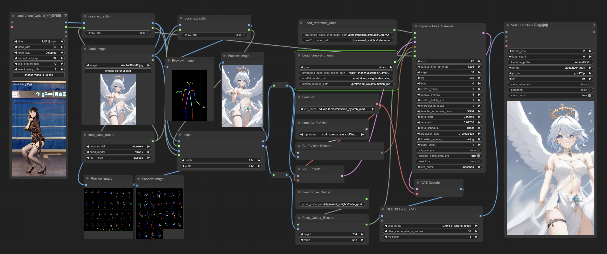

# ComfyUI-Dynamicpose

## Install

1.  Clone this repo into the  `Your ComfyUI root directory\ComfyUI\custom_nodes\` and install dependent Python packages:
    ```bash
    cd Your_ComfyUI_root_directory\ComfyUI\custom_nodes\

    git clone https://github.com/Bin-sam/DynamicPose-ComfyUI.git

    pip install -r requirements.txt
    ```
2. Download pre-trained models:
    - [stable-diffusion-v1-5_unet](https://huggingface.co/runwayml/stable-diffusion-v1-5/tree/main/unet)
    - [Moore-AnimateAnyone Pre-trained Models](https://huggingface.co/DynamicXLAB/DynamicPose/tree/main)
    - [DWpose](https://github.com/IDEA-Research/DWPose/tree/onnx) model download links are under title "DWPose for ControlNet".
    - Above models need to be put under folder [pretrained_weights](./pretrained_weights/) as follow:
    ```text
    ./pretrained_weights/
    |-- denoising_unet.pth
    |-- motion_module.pth
    |-- pose_guider.pth
    |-- reference_unet.pth
    |-- rtmpose
        |   |-- rtmw-x_simcc-cocktail14_pt-ucoco_270e-384x288-f840f204_20231122.pth
        |   |-- rtmw-x_8xb320-270e_cocktail14-384x288.py
        |   |-- rtmdet_m_640-8xb32_coco-person.py
        |   |-- rtmdet_m_8xb32-100e_coco-obj365-person-235e8209.pth
        |   |-- rtmpose-x_8xb256-700e_coco-384x288.py
        |   |-- rtmpose-x_simcc-body7_pt-body7_700e-384x288-71d7b7e9_20230629.pth
    |-- DWPose
        |   |-- dw-ll_ucoco_384.onnx
        |   |-- yolox_l.onnx
    ```
    - Download clip image encoder (e.g. [sd-image-variations-diffusers ](https://huggingface.co/lambdalabs/sd-image-variations-diffusers/tree/main/image_encoder)) and put it under `Your_ComfyUI_root_directory\ComfyUI\models\clip_vision`
    - Download vae (e.g. [sd-vae-ft-mse](https://huggingface.co/stabilityai/sd-vae-ft-mse/tree/main)) and put it under `Your_ComfyUI_root_directory\ComfyUI\models\vae`
    - Download stable-diffusion-v1-5 (e.g. [stable-diffusion-v1-5](https://huggingface.co/runwayml/stable-diffusion-v1-5)) and put it under `Your_ComfyUI_root_directory\ComfyUI\models\diffusers`

## Usage

1. Using pipeline examples
  <br>
  this workflow is [Pose_to_video](example/Pose_to_Video.json)


